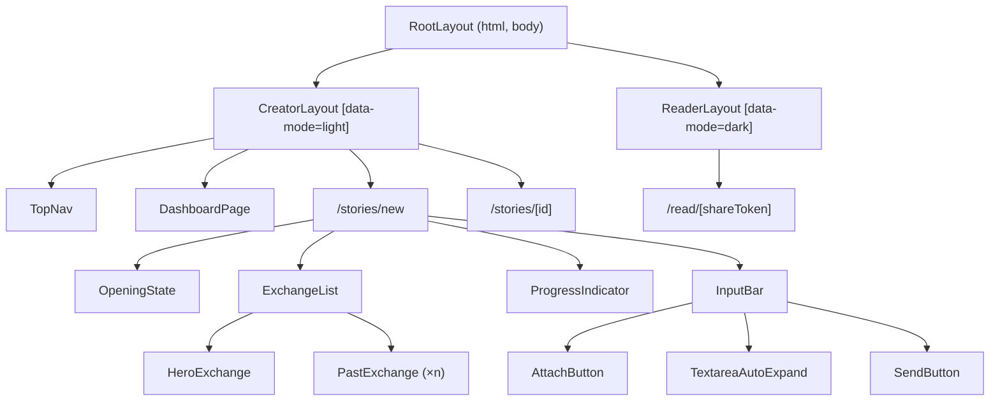

# Design Document: Waggle Dance Design System Overhaul & Intake Redesign

## Overview

This design covers a comprehensive visual and structural overhaul of the Waggle Dance application. The changes span three major areas:

1. **Navigation restructure** — Replace the existing 240px fixed sidebar (`Sidebar.tsx`) with a 48px transparent top navigation bar, reclaiming horizontal space on all creator screens.
2. **Design token system** — Replace the current `@theme` block in `globals.css` with a scoped CSS custom property architecture that supports light mode (creator screens) and dark mode (reading experience) without conflicts.
3. **Intake screen rebuild** — Redesign `/stories/new` with a bottom-up conversation layout, Framer Motion entrance animations, a 4-segment progress indicator, and a redesigned input bar with strict AI conversational constraints.

The existing tech stack (Next.js App Router, TypeScript, Tailwind CSS v4, Framer Motion, Supabase) remains unchanged. No new dependencies are introduced.

## Architecture

### High-Level Component Tree



### Route-to-Layout Mapping

| Route | Layout | Mode | Has TopNav |
|-------|--------|------|-----------|
| `/dashboard` | `CreatorLayout` | light | Yes |
| `/stories/new` | `CreatorLayout` | light | Yes |
| `/stories/[id]` | `CreatorLayout` | light | Yes |
| `/read/[shareToken]` | `ReaderLayout` | dark | No |
| `/auth/login` | None (minimal) | light | No |

### CSS Token Scoping Strategy

Mode scoping uses a `data-mode` attribute on the layout wrapper element rather than a media query or class toggle. This allows both modes to coexist in the same session without conflicts:

```
html
  body
    [data-mode="light"]  ← CreatorLayout sets light tokens
      TopNav
      Page content...
    
    [data-mode="dark"]   ← ReaderLayout sets dark tokens
      Reader content...
```

The `globals.css` file defines tokens under scoped selectors:

```css
[data-mode="light"] {
  --surface-page: #f7f6f2;
  --text-primary: #111111;
  /* ... all light tokens */
}

[data-mode="dark"] {
  --surface-page: #000000;
  --text-primary: #ffffff;
  /* ... all dark tokens */
}
```

Components reference generic token names (e.g., `var(--surface-page)`, `var(--text-primary)`) and the scoping attribute resolves the correct value. This eliminates the need for `-dark` suffixed tokens in component code.

### Sidebar Removal Plan

1. Delete `src/components/ui/Sidebar.tsx`
2. Update `src/app/stories/layout.tsx` — remove `Sidebar` import and `md:ml-[var(--sidebar-width)]`
3. Update `src/app/dashboard/layout.tsx` — same removal
4. Remove `--sidebar-width: 240px` from `globals.css`
5. Replace with `CreatorLayout` component that renders `TopNav` + content area

## Components and Interfaces

### TopNav Component

**File:** `src/components/ui/TopNav.tsx`

```typescript
interface TopNavProps {
  // No props needed — reads route from usePathname()
}
```

**Behavior:**
- 48px height, full-width, transparent background inheriting `--surface-page`
- 1px bottom border using `--border-default`
- Left: "Waggle Dance" wordmark (14px, weight 500, `--text-primary`)
- Right: "Library" ghost button + "+ New" pill button, 8px gap
- Responsive padding: 24px below 768px, 40px at 768px+
- Does NOT render on `/read/[shareToken]` routes (handled by layout exclusion)

### CreatorLayout Component

**File:** `src/components/layout/CreatorLayout.tsx`

```typescript
interface CreatorLayoutProps {
  children: React.ReactNode
}
```

**Behavior:**
- Wraps all creator-facing routes
- Sets `data-mode="light"` on its root element
- Renders `<TopNav />` followed by `<main>` content
- Replaces current sidebar-based layouts in `/dashboard/layout.tsx` and `/stories/layout.tsx`

### IntakeScreen (Page Component)

**File:** `src/app/stories/new/page.tsx` (rewrite)

**State machine phases:** `'opening' | 'conversing' | 'style' | 'generating'`

```typescript
interface IntakeScreenState {
  phase: 'opening' | 'conversing' | 'style' | 'generating'
  storyId: string | null
  exchanges: Exchange[]
  signals: Partial<IntakeSignals>
  currentQuestion: number // 0-3, maps to progress indicator
}

interface Exchange {
  question: string      // AI question text
  answer: string | null // Creator answer (null if unanswered hero)
  signalKey: keyof IntakeSignals | null
}
```

### ExchangeList Component

**File:** `src/components/intake/ExchangeList.tsx`

```typescript
interface ExchangeListProps {
  exchanges: Exchange[]
  isStreaming: boolean
}
```

**Behavior:**
- Uses `flex-col-reverse` layout (CSS `flex-direction: column-reverse`) for bottom-up stacking
- Newest exchange (hero) renders at `--text-question` (20px) size
- All previous exchanges render at `--text-sm` (13px), questions in `--text-muted`, answers in `--text-secondary`
- Separator: 1px `--border-default` with 8px vertical margin between exchanges

### HeroExchange Component

**File:** `src/components/intake/HeroExchange.tsx`

```typescript
interface HeroExchangeProps {
  question: string
  isNew: boolean // triggers entrance animation
}
```

**Framer Motion animation:**
```typescript
const heroVariants = {
  hidden: { opacity: 0, y: 12 },
  visible: { 
    opacity: 1, 
    y: 0,
    transition: { duration: 0.35, ease: [0.25, 0.1, 0.25, 1], delay: 0.05 }
  }
}
```

### PastExchange Component

**File:** `src/components/intake/PastExchange.tsx`

```typescript
interface PastExchangeProps {
  question: string
  answer: string
  isCollapsing: boolean // triggers shrink animation from hero → past
}
```

**Framer Motion animation (collapse from hero):**
```typescript
const collapseVariants = {
  hero: { fontSize: '20px', color: 'var(--text-primary)' },
  past: { 
    fontSize: '13px', 
    color: 'var(--text-muted)',
    transition: { duration: 0.3, ease: [0.25, 0.1, 0.25, 1] }
  }
}
```

### ProgressIndicator Component

**File:** `src/components/intake/ProgressIndicator.tsx`

```typescript
interface ProgressIndicatorProps {
  currentStep: number  // 0-3
  completedSteps: number // 0-4
  visible: boolean
}

type SegmentState = 'done' | 'active' | 'empty'
```

**Behavior:**
- 4 pill segments, 2px height, fully rounded, 4px gap
- Row is 24px tall, constrained to `--content-max` (600px), centered
- Segments map to fixed questions: idea → desired outcome → audience → resistance
- Color transitions use 400ms duration
- Hidden during opening state

### InputBar Component

**File:** `src/components/intake/InputBar.tsx`

```typescript
interface InputBarProps {
  onSubmit: (text: string) => void
  onAttach: () => void
  isDisabled: boolean
  attachError: string | null
}
```

**Behavior:**
- Sticky to bottom, inherits `--surface-page` background, 1px top border
- Padding: `12px 24px 20px` (extra bottom for mobile home indicator)
- Inner container: `--content-max` width, centered
- Flex row: AttachButton (34×34 circle) | textarea (flex:1) | SendButton (34×34 circle)
- Textarea: auto-expands 1–5 lines, `--surface-input` bg, 18px border-radius
- Enter submits, Shift+Enter inserts newline
- SendButton: `--accent` fill, white arrow, disabled at 0.35 opacity when input is empty
- SendButton active: scale(0.94) for 100ms

### OpeningState Component

**File:** `src/components/intake/OpeningState.tsx`

```typescript
interface OpeningStateProps {
  visible: boolean
  onDismiss: () => void // triggered by first message submit
}
```

**Framer Motion exit:**
```typescript
const exitVariants = {
  visible: { opacity: 1, y: 0 },
  hidden: { 
    opacity: 0, 
    y: -8,
    transition: { duration: 0.2 }
  }
}
```

## Data Models

### Design Tokens (CSS Custom Properties)

The token system replaces the current `@theme` block. Tokens are organized by category:

#### Color Tokens (scoped via `[data-mode]`)

```
[data-mode="light"]:
  --surface-page: #f7f6f2
  --surface-card: #ffffff
  --surface-input: #ffffff
  --surface-bar: transparent
  --text-primary: #111111
  --text-secondary: rgba(0,0,0,0.5)
  --text-muted: rgba(0,0,0,0.32)
  --text-placeholder: rgba(0,0,0,0.25)
  --border-default: rgba(0,0,0,0.08)
  --border-input: rgba(0,0,0,0.14)
  --border-input-focus: rgba(0,0,0,0.3)
  --accent: #c47a00
  --accent-bg: rgba(180,108,0,0.08)
  --accent-border: rgba(180,108,0,0.2)
  --progress-done: rgba(180,108,0,0.35)
  --progress-active: #c47a00
  --progress-empty: rgba(0,0,0,0.1)

[data-mode="dark"]:
  --surface-page: #000000
  --surface-elevated: #0d0d0d
  --surface-card: #1a1a1c
  --surface-input: #1a1a1c
  --text-primary: #ffffff
  --text-secondary: rgba(255,255,255,0.5)
  --text-muted: rgba(255,255,255,0.32)
  --text-placeholder: rgba(255,255,255,0.22)
  --border-default: rgba(255,255,255,0.07)
  --border-input: rgba(255,255,255,0.12)
  --border-input-focus: rgba(255,159,10,0.3)
  --accent: #ff9f0a
  --accent-bg: rgba(255,159,10,0.08)
  --accent-border: rgba(255,159,10,0.2)
  --progress-done: rgba(255,159,10,0.5)
  --progress-active: #ff9f0a
  --progress-empty: rgba(255,255,255,0.1)
```

#### Typography Tokens (global, not scoped)

```
--font-ui: -apple-system, BlinkMacSystemFont, 'SF Pro Text', 'Helvetica Neue', sans-serif
--font-reading: Georgia, 'New York', serif

--text-xs: 11px (line-height 1.45)
--text-sm: 13px (line-height 1.45)
--text-base: 15px (line-height 1.5)
--text-md: 17px (line-height 1.5)
--text-lg: 20px (line-height 1.4)
--text-xl: 24px (line-height 1.35)
--text-2xl: 30px (line-height 1.3)

--text-question: 20px
--text-question-weight: 400
--text-question-leading: 1.45
--text-question-tracking: -0.015em
```

#### Spacing Tokens (global)

```
--space-1: 4px
--space-2: 8px
--space-3: 12px
--space-4: 16px
--space-5: 20px
--space-6: 24px
--space-8: 32px
--space-10: 40px
--content-max: 600px
```

#### Motion Tokens (global)

```
--duration-fast: 150ms
--duration-base: 250ms
--duration-slow: 400ms
--ease-default: cubic-bezier(0.25, 0.1, 0.25, 1)
--ease-spring: cubic-bezier(0.34, 1.56, 0.64, 1)
```

### Intake AI System Prompt (Revised)

The current `buildIntakeSystemPrompt()` function is replaced with a constrained version enforcing the strict conversational rules from Requirement 11:

**Key changes from current prompt:**
- Remove "briefly reflect back or reframe" instruction (violates no-affirmation rule)
- Remove permission for 2-3 sentences before the question (question IS the entire response)
- Replace flexible interview modes with a fixed 4-question sequence
- Enforce hard 20-word maximum per response
- Remove all structured choice and continuum modes
- Add explicit prohibitions: no affirmations, no markdown, no em dashes

**New prompt structure:**
```
Role: Sharp colleague asking good questions
Constraint: Exactly 1 interrogative sentence per turn, ≤20 words total
Sequence: Fixed 4 questions in order (idea → desired outcome → audience → resistance)
Tone: Direct, no hedging, no therapeutic language
Forbidden: Affirmations, markdown, em dashes, preambles
Signal extraction: Same JSON block mechanism (hidden from user)
Completion: After Q4, emit [SIGNALS_READY] — one inference-confirm allowed if genuinely unclear
```

### Framer Motion Animation Patterns

All intake animations use a shared motion configuration:

```typescript
// src/lib/motion/intake.ts

export const INTAKE_MOTION = {
  heroEnter: {
    initial: { opacity: 0, y: 12 },
    animate: { opacity: 1, y: 0 },
    transition: { duration: 0.35, ease: [0.25, 0.1, 0.25, 1], delay: 0.05 },
  },
  heroCollapse: {
    animate: { fontSize: '13px', color: 'var(--text-muted)' },
    transition: { duration: 0.3, ease: [0.25, 0.1, 0.25, 1] },
  },
  openingExit: {
    exit: { opacity: 0, y: -8 },
    transition: { duration: 0.2 },
  },
  sendPress: {
    whileTap: { scale: 0.94 },
    transition: { duration: 0.1 },
  },
  progressFill: {
    transition: { duration: 0.4, ease: [0.25, 0.1, 0.25, 1] },
  },
} as const

// Reduced motion hook
export function useReducedMotion(): boolean {
  // Delegates to framer-motion's useReducedMotion()
  // When true, all entrance animations skip to final state
  // All state transitions apply instantly
}
```

### globals.css Restructure

The current `@theme { ... }` block is replaced entirely:

```css
@import 'tailwindcss';

/* ─── Global tokens (mode-independent) ─── */
:root {
  --font-ui: -apple-system, BlinkMacSystemFont, 'SF Pro Text', 'Helvetica Neue', sans-serif;
  --font-reading: Georgia, 'New York', serif;
  
  /* Type scale */
  --text-xs: 11px;
  --text-sm: 13px;
  --text-base: 15px;
  --text-md: 17px;
  --text-lg: 20px;
  --text-xl: 24px;
  --text-2xl: 30px;
  
  /* Spacing (4px base) */
  --space-1: 4px;
  --space-2: 8px;
  --space-3: 12px;
  --space-4: 16px;
  --space-5: 20px;
  --space-6: 24px;
  --space-8: 32px;
  --space-10: 40px;
  --content-max: 600px;
  
  /* Motion */
  --duration-fast: 150ms;
  --duration-base: 250ms;
  --duration-slow: 400ms;
  --ease-default: cubic-bezier(0.25, 0.1, 0.25, 1);
  --ease-spring: cubic-bezier(0.34, 1.56, 0.64, 1);
  
  /* Radii */
  --radius-sm: 6px;
  --radius-md: 10px;
  --radius-lg: 14px;
  --radius-xl: 20px;
  
  /* Question typography */
  --text-question: 20px;
  --text-question-weight: 400;
  --text-question-leading: 1.45;
  --text-question-tracking: -0.015em;
}

/* ─── Light mode (creator screens) ─── */
[data-mode="light"] {
  --surface-page: #f7f6f2;
  --surface-card: #ffffff;
  --surface-input: #ffffff;
  --surface-bar: transparent;
  --text-primary: #111111;
  --text-secondary: rgba(0,0,0,0.5);
  --text-muted: rgba(0,0,0,0.32);
  --text-placeholder: rgba(0,0,0,0.25);
  --border-default: rgba(0,0,0,0.08);
  --border-input: rgba(0,0,0,0.14);
  --border-input-focus: rgba(0,0,0,0.3);
  --accent: #c47a00;
  --accent-bg: rgba(180,108,0,0.08);
  --accent-border: rgba(180,108,0,0.2);
  --progress-done: rgba(180,108,0,0.35);
  --progress-active: #c47a00;
  --progress-empty: rgba(0,0,0,0.1);
}

/* ─── Dark mode (reading experience) ─── */
[data-mode="dark"] {
  --surface-page: #000000;
  --surface-elevated: #0d0d0d;
  --surface-card: #1a1a1c;
  --surface-input: #1a1a1c;
  --text-primary: #ffffff;
  --text-secondary: rgba(255,255,255,0.5);
  --text-muted: rgba(255,255,255,0.32);
  --text-placeholder: rgba(255,255,255,0.22);
  --border-default: rgba(255,255,255,0.07);
  --border-input: rgba(255,255,255,0.12);
  --border-input-focus: rgba(255,159,10,0.3);
  --accent: #ff9f0a;
  --accent-bg: rgba(255,159,10,0.08);
  --accent-border: rgba(255,159,10,0.2);
  --progress-done: rgba(255,159,10,0.5);
  --progress-active: #ff9f0a;
  --progress-empty: rgba(255,255,255,0.1);
}

/* ─── Reduced motion ─── */
@media (prefers-reduced-motion: reduce) {
  *, *::before, *::after {
    animation-duration: 0ms !important;
    transition-duration: 0ms !important;
  }
}
```


## Correctness Properties

*A property is a characteristic or behavior that should hold true across all valid executions of a system — essentially, a formal statement about what the system should do. Properties serve as the bridge between human-readable specifications and machine-verifiable correctness guarantees.*

### Property 1: WCAG Contrast Ratio Compliance

*For any* text-on-background color token pairing defined in the design token system (both light and dark modes), the computed contrast ratio SHALL be at least 4.5:1 for text sizes below 18px and at least 3:1 for text sizes 18px or above.

**Validates: Requirements 2.6**

### Property 2: Reduced Motion Disables All Entrance Animations

*For any* component that uses an entrance animation (opacity fade, translateY slide, scale), when the `prefers-reduced-motion: reduce` media query is active, the element SHALL appear in its final rendered state with zero animation duration and zero transition duration.

**Validates: Requirements 5.4, 7.4, 8.7**

### Property 3: Opening State Irreversibility

*For any* intake session where the creator has submitted at least one message, the opening state (headline + subtitle) SHALL never be rendered again regardless of subsequent user actions within that session.

**Validates: Requirements 7.2**

### Property 4: Exchange Typography Invariant

*For any* non-empty exchange list of length N, the most recent AI question SHALL render at font-size 20px with `--text-primary` color, and all N-1 preceding AI questions SHALL render at font-size 13px with `--text-muted` color, with creator answers at 13px in `--text-secondary` color.

**Validates: Requirements 8.2, 8.3**

### Property 5: Bottom-Up Exchange Ordering

*For any* list of exchanges rendered in the intake conversation, the visual ordering SHALL place the newest exchange closest to the input bar and all previous exchanges above it in reverse-chronological order (most recent at bottom).

**Validates: Requirements 8.1**

### Property 6: Auto-Scroll on Overflow

*For any* exchange list that exceeds the visible height of the conversation container, the newest exchange SHALL be scrolled into view so that it is visible without manual user scrolling.

**Validates: Requirements 8.6**

### Property 7: Progress Indicator Segment State Correctness

*For any* integer `currentStep` in range [0, 3] representing the number of completed intake questions, the progress indicator SHALL render segments[0..currentStep-1] as "done" (filled with `--progress-done`), segments[currentStep] as "active" (filled with `--progress-active`), and segments[currentStep+1..3] as "empty" (filled with `--progress-empty`).

**Validates: Requirements 9.2, 9.6**

### Property 8: File Upload Validation

*For any* file selected via the attach button, if the file size exceeds 20 MB OR the file type is not one of [PDF, PPTX, DOCX], the system SHALL reject the file without initiating an upload and SHALL display an inline error message.

**Validates: Requirements 10.5**

### Property 9: Textarea Auto-Expand Clamping

*For any* text input in the intake textarea, the rendered height SHALL equal min(scrollHeight, 5 lines) with a minimum of 1 line (~38px). When content exceeds 5 lines, the textarea SHALL scroll internally rather than growing further.

**Validates: Requirements 10.6**

### Property 10: Send Button Disabled State

*For any* string composed entirely of whitespace characters (including empty string), the send button SHALL render at 0.35 opacity and be non-interactive. *For any* string containing at least one non-whitespace character, the send button SHALL render at full opacity and be interactive.

**Validates: Requirements 10.10, 10.11**

### Property 11: AI Response Format Constraints

*For any* response produced by the intake engine, the response SHALL contain exactly one interrogative sentence (ending with "?"), the total word count SHALL NOT exceed 20, and the response SHALL NOT contain affirmation phrases ("Great", "Got it", "Perfect", "Interesting", "That's helpful"), markdown formatting characters (*, **, -, bullet points), or em dashes (—).

**Validates: Requirements 11.1, 11.2, 11.6**

## Error Handling

### Authentication Errors

| Scenario | Behavior |
|----------|----------|
| Unauthenticated access to `/stories/new` | Redirect to `/auth/login` before rendering any intake UI |
| Session expires mid-conversation | Show non-blocking error toast; preserve local state; prompt re-auth |
| Supabase auth callback failure | Display error on login page with retry action |

### Intake Chat Errors

| Scenario | Behavior |
|----------|----------|
| Network failure during streaming | Show inline error below conversation; auto-retry once after 2s; if still failing, show "Try again" button |
| AI response timeout (>30s) | Abort stream, show "Response took too long. Try again." |
| Malformed signal extraction | Silently ignore; continue conversation without updating signals |
| API returns 429 (rate limit) | Show "Please wait a moment" with countdown |

### File Upload Errors

| Scenario | Behavior |
|----------|----------|
| File too large (>20MB) | Reject immediately client-side; show inline error "File must be under 20 MB" auto-dismissing after 5s |
| Unsupported format | Reject immediately client-side; show inline error "Only PDF, PPTX, and DOCX files are supported" auto-dismissing after 5s |
| Upload network failure | Show error with retry button |
| Document parsing failure (server) | Show "Could not read document. Try a different file." |

### Navigation Errors

| Scenario | Behavior |
|----------|----------|
| Story creation fails on mount | Show centered error state with "Try Again" button |
| Database write failure (transcript persist) | Log error; do NOT block conversation flow; retry silently on next exchange |

### CSS Token Fallbacks

All CSS custom properties should include fallback values in their `var()` calls for resilience:
```css
background-color: var(--surface-page, #f7f6f2);
color: var(--text-primary, #111111);
```

## Testing Strategy

### Unit Tests (Example-Based)

Unit tests cover specific UI states, interactions, and rendering:

- **TopNav**: Renders on creator routes, absent on reader routes; buttons navigate correctly; responsive padding applies at breakpoints
- **OpeningState**: Renders when no messages; disappears after first submit; centered and width-constrained
- **InputBar**: Enter submits, Shift+Enter inserts newline; attach button opens file picker with correct accept filter; focus changes border color
- **ProgressIndicator**: Renders 4 segments; hidden before first exchange; shows after first exchange; segments correspond to fixed question order
- **ExchangeList**: Renders correct DOM structure; dividers appear between exchanges
- **Design tokens**: Smoke tests verifying all CSS custom properties are defined in `globals.css`

### Property-Based Tests

Property-based tests validate universal correctness properties using [fast-check](https://github.com/dubzzz/fast-check) (already compatible with the vitest setup).

**Configuration:**
- Minimum 100 iterations per property test
- Each test tagged with: `Feature: waggle-dance, Property {N}: {title}`

| Property | Generator Strategy |
|----------|-------------------|
| P1: Contrast ratio | Generate all token pairings from defined color sets; compute relative luminance |
| P2: Reduced motion | Generate random component animation configs; verify duration=0 when reduced motion is mocked |
| P3: Opening state irreversibility | Generate random sequences of 1–10 user messages; verify opening state stays hidden |
| P4: Exchange typography | Generate exchange lists of length 1–20; verify hero/past typography assignment |
| P5: Bottom-up ordering | Generate exchange lists of length 1–20; verify visual order matches reverse-chronological |
| P6: Auto-scroll | Generate exchange lists exceeding container height; verify scroll position |
| P7: Progress segments | Generate currentStep ∈ {0,1,2,3}; verify segment states |
| P8: File validation | Generate files with random sizes (0–100MB) and types (valid + invalid); verify accept/reject |
| P9: Textarea clamping | Generate strings with 0–20 newlines; verify height bounds |
| P10: Send button state | Generate strings of whitespace-only and mixed content; verify disabled/enabled |
| P11: AI response format | Generate/mock AI responses; verify single question, ≤20 words, no forbidden patterns |

### Integration Tests

- **Full intake flow**: Send 4 messages through the real `/api/intake/chat` endpoint; verify signals are extracted and `[SIGNALS_READY]` is emitted
- **Auth guard**: Verify unauthenticated requests to `/api/intake/chat` return 401
- **File upload**: Upload valid and invalid files to `/api/documents/upload`; verify accept/reject behavior

### Visual Regression

- Snapshot the TopNav at 390px, 768px, and 1280px viewports
- Snapshot the intake screen in opening state and with 3 exchanges
- Snapshot progress indicator in all 5 possible step states (0–4 completed)
